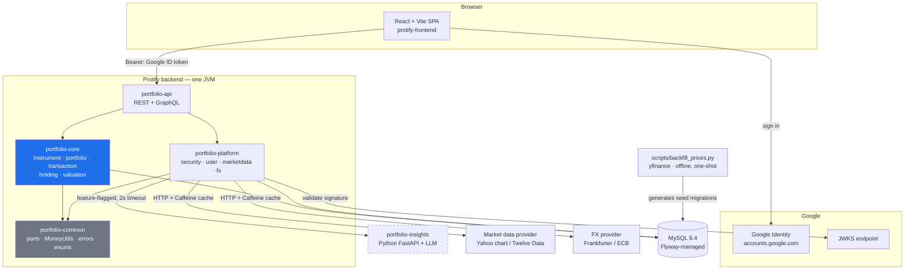
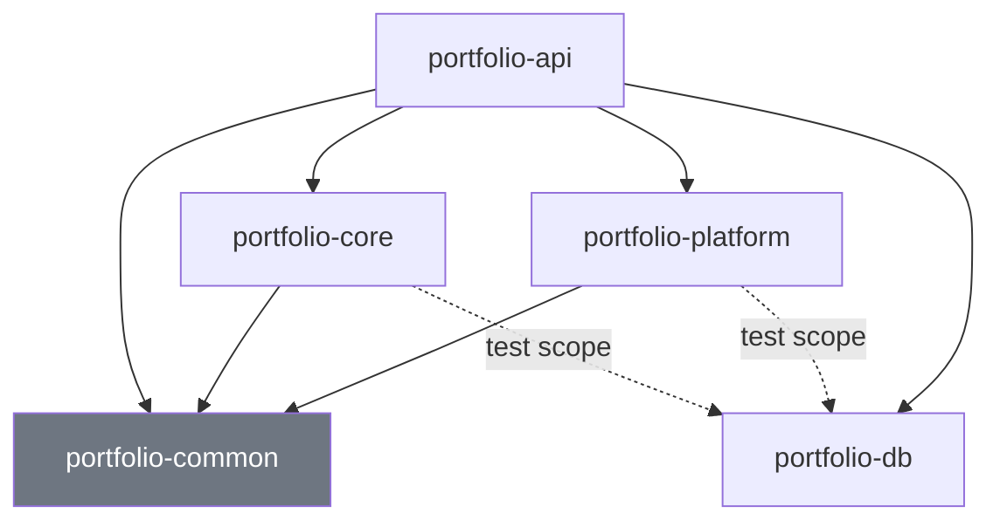
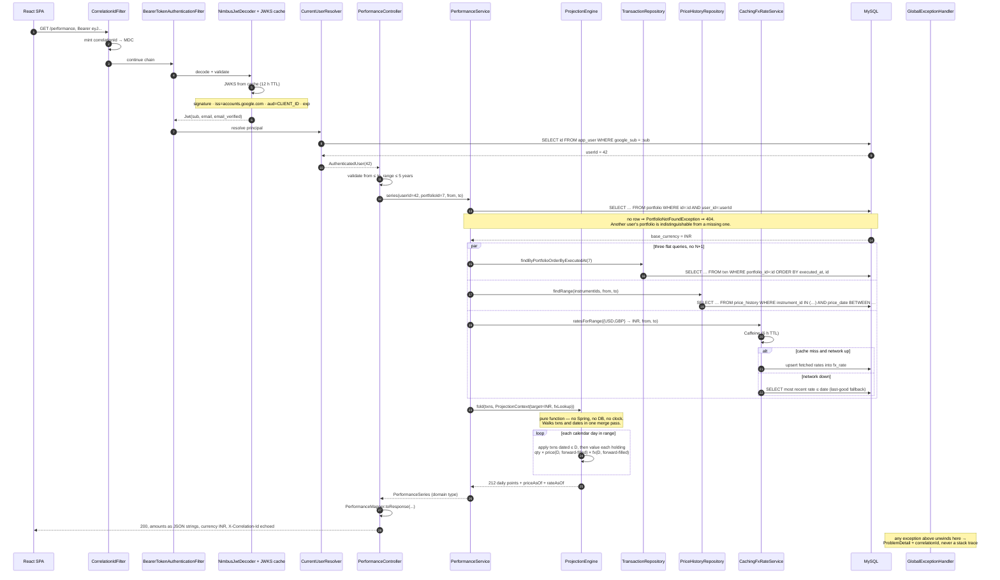
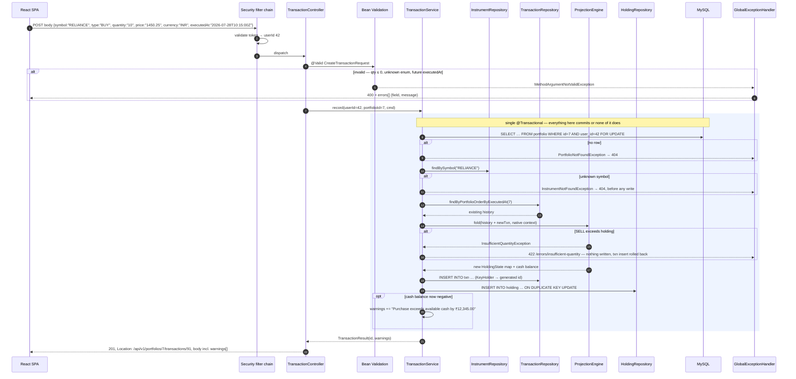
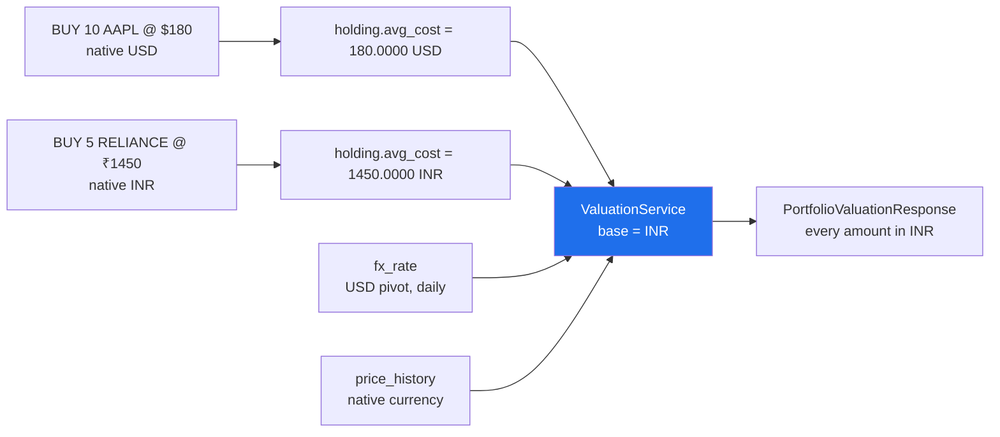
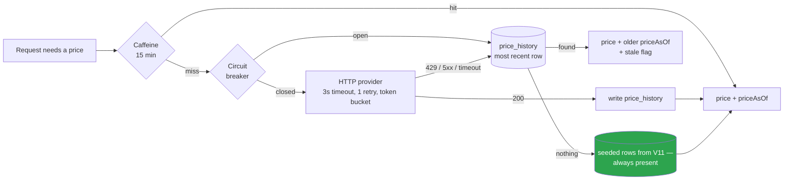
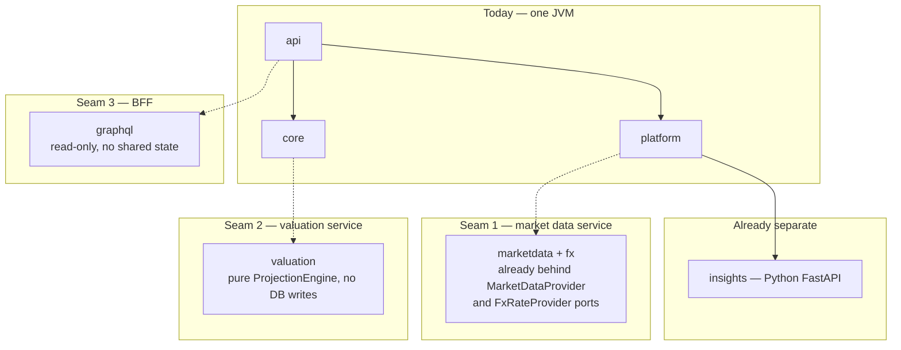

# ARCHITECTURE.md — Protify Portfolio Manager

Modular monolith in Java, one companion Python service, one React SPA.
Base package `com.protify.portfolio`. Read `/docs/PLAN.md` §2 first — it amends the
reference design, and this document reflects the amended version.

---

## 1. System context



Everything outside the JVM box is optional at runtime. **Pull the network cable and the
product still works** — that constraint drives most of what follows.

---

## 2. Modules and the dependency rule



| Module | Owner | Contains | Frozen? |
|---|---|---|---|
| `portfolio-common` | A | `MoneyUtils`, `Money`, enums, `DomainException` tree, **ports**: `MarketDataProvider`, `FxRateProvider` | **Yes, end of Day 1** |
| `portfolio-db` | shared | Flyway migrations only. Add-only, per-dev number ranges | No — grows daily |
| `portfolio-core` | A | `instrument` `portfolio` `transaction` `holding` `valuation` | No |
| `portfolio-platform` | B | `config` `security` `user` `marketdata` `fx` `insights` | No |
| `portfolio-api` | C | `api` (controllers, dto, mapper, error) `graphql`, `PortfolioApplication` | No |

**The rule that matters: `portfolio-core` has no dependency on `portfolio-platform`.**
Core needs prices and FX rates; it gets them through interfaces declared in `common` and
implemented in `platform`, wired by Spring at startup. A developer who tries to call an HTTP
client from the valuation engine gets a compile error, not a code-review comment.

This is ports-and-adapters applied only where it earns its keep — at the two boundaries that
face the network. Everywhere else, a service calls a repository directly, because a project
this size does not need an interface per class.

---

## 3. Layering inside a module

```
Controller      HTTP, status codes, DTOs. No business logic. Never sees a domain entity.
    ↓  (Mapper — explicit, hand-written, unit-tested)
Service         Business rules, @Transactional boundaries, orchestration.
    ↓
Repository      NamedParameterJdbcTemplate + explicit SQL + hand-written RowMapper.
                No business logic. Every user-scoped query takes userId as an argument.
    ↓
MySQL
```

Enforced by ownership, review, and one structural fact: DTO records live in
`portfolio-api`, which `portfolio-core` cannot see. A repository type physically cannot be
returned from a controller without adding a dependency that does not exist.

---

## 4. Read path — `GET /api/v1/portfolios/7/performance?from=2026-01-01&to=2026-07-30`

The hardest read in the product: three currencies, historical prices, historical FX.



Where each requirement is discharged on this path:

| Requirement | Step |
|---|---|
| Auth required | 3–7, before any controller code runs |
| User scoping | 10 — the `WHERE user_id` is in the SQL, not in a Java `if` |
| Another user's data | 11 — 404, never 403, so existence is not confirmed |
| No internet | 16 — last-good `fx_rate` row; same shape for `price_history` |
| Missing price | forward-fill inside the fold; `priceAsOf` exposed in the response |
| No `double` anywhere | `Money`/`BigDecimal` from the RowMapper to the JSON string |
| Correlation ID | 1 and 24 |

---

## 5. Write path — `POST /api/v1/portfolios/7/transactions`



**Delete is the same picture with one difference.** `DELETE …/transactions/{txnId}` takes the
same `FOR UPDATE` lock, removes the row, then **replays the entire remaining history through
the same `ProjectionEngine`** and rewrites the projection. There is no separate reversal
code path, so there is nothing to drift out of sync — the mid-history-delete case and the
ordinary-append case are literally the same function call.

---

## 6. Currency model

Three currency concepts, kept strictly apart:

| Concept | Where it lives | Mutable? |
|---|---|---|
| **Native / trading currency** | `instrument.currency`, `txn.currency`, `holding.avg_cost` | Never |
| **Base currency** | `portfolio.base_currency` | Yes — user-editable |
| **Presentation currency** | `?currency=` query override | Per request |



`positionValue(base) = quantity × price(native) × fx(native → base, on date)`

Rates are stored against a **USD pivot** — one row per currency per day, and a cross rate is
`rate(USD→quote) ÷ rate(USD→base)`. Storing pairs directly would be O(n²) rows for no gain.

Cost basis uses the FX rate **at each transaction's date**, not today's, so reported P&L
correctly contains both the market move and the currency move. This is why cost basis is
recomputed by replaying history rather than read from `holding` — see `/docs/PLAN.md` §5.

Changing a portfolio's base currency writes exactly one column on one row and touches no
`txn` or `holding`. `BaseCurrencyImmutabilityIT` asserts that.

---

## 7. Resilience — every external call, and what happens when it fails



| External dependency | Primary | Fallback 1 | Fallback 2 | Never |
|---|---|---|---|---|
| Market prices | Yahoo chart / Twelve Data | Caffeine 15 min | `price_history`, then `V11` seed | throws to the caller |
| FX rates | Frankfurter (ECB) | Caffeine 6 h | `fx_rate` last-good, then `V12` seed | hard-coded rate |
| Google JWKS | Google | Spring's JWKS cache | — | a self-signed token is accepted |
| LLM insights | FastAPI + LLM | rule-based summary in Java | feature flag → 501 | blocks the page |

Google JWKS is the one dependency with no offline story, and that is correct: a token whose
signature cannot be verified must be rejected. The mitigation is operational, not
architectural — Spring caches the key set, and the demo signs in once at the start.

---

## 8. Extraction seams

The monolith is drawn so that each of these becomes a service by moving a directory and
adding a client behind an interface that already exists. Named now; **not built now**.



| Seam | What makes it a seam today | Extraction cost | Trigger to actually do it |
|---|---|---|---|
| **1 · Market data + FX** | Already behind `MarketDataProvider` / `FxRateProvider` in `common`. No core code imports an HTTP client | ~1 day: new Spring Boot app, ports become a Feign/RestClient adapter, `price_history` and `fx_rate` move with it | Price refresh starts competing with request traffic, or a second product needs the same prices |
| **2 · Valuation** | `ProjectionEngine` is a pure function with no I/O. `ValuationService` performs no writes | ~2 days: needs a transaction-history feed (event stream or read replica) | Valuation CPU dominates, or back-testing arrives and needs to scale independently |
| **3 · GraphQL BFF** | `portfolio-api/graphql` shares only the security context with REST | ~0.5 day: it is already a separate package with its own resolvers | A second client (mobile) needs a different shape from the REST one |
| **4 · Insights** | Already a separate process, separate language, feature-flagged, with an in-process fallback | Zero — it is already extracted | Done |

Deliberately *not* seams: `portfolio`, `transaction` and `holding`. They share one
transactional invariant — the projection must be written in the same DB transaction as the
transaction row. Splitting them means distributed transactions or eventual consistency, and
we would be trading a `@Transactional` annotation for a saga. `/docs/DECISIONS/0003` argues
this out.

---

## 9. What we are deliberately not building

Stated plainly, because the gap between "did not think of it" and "decided against it" is
most of what gets assessed.

| Not building | Why | What we would do instead if asked |
|---|---|---|
| Spring Cloud Gateway / Eureka / Config Server | 3 developers, 6 days, one deployable. Service discovery for a single service is ceremony. Costs ~2 days and adds four failure modes | Extract along §8's seams when a second team or a second scaling profile exists |
| Kafka / event sourcing | We have the *benefit* of event sourcing already — `txn` is the log and `holding` is the projection — without the operational cost | Publish domain events from `TransactionService` at the existing seam |
| Our own JWT + refresh tokens | Google ID tokens are already signed, short-lived and validated by Spring. Writing our own gets us a worse version of a solved problem. See ADR-0004 | `POST /auth/session` exchange — designed in the ADR, not implemented |
| FIFO / specific-lot cost basis | Weighted average matches `holding.avg_cost` and needs no lot table. See ADR-0005 | `txn_lot` table + a lot-aware `ProjectionEngine` strategy; the engine takes it as a parameter already |
| Corporate actions (splits, mergers) | Real, hard, and not on the customer's priority list. A split would silently corrupt quantities | `corporate_action` table replayed by the projection engine — it is a fold, so this fits naturally |
| Intraday / streaming prices | Free tiers do not offer it, and a daily-close chart satisfies "view performance" | WebSocket provider behind the same `MarketDataProvider` port |
| Multi-tenancy beyond per-user scoping | `user_id` on every query is the requirement. Row-level security or schema-per-tenant is not | — |
| Quantum optimiser | Cut on Day 0. ADR-0009 | Classical mean-variance optimiser; strictly better and a third of the work |
| Soft deletes / audit trail | `txn` is already an append-mostly ledger. Full audit is a compliance requirement nobody stated | `txn_audit` trigger or an outbox |
| Horizontal scaling, k8s, HPA | One container, one instance, one instructor | The Dockerfile is already stateless; anything else is deployment config |

---

## 10. Cross-cutting concerns, and where each one lives

| Concern | Implementation | Module |
|---|---|---|
| Correlation ID | `CorrelationIdFilter` → MDC → response header → every `ProblemDetail` | platform |
| Authentication | Spring Security resource server, JWKS-validated | platform |
| Authorisation | `WHERE user_id = :userId` in every SQL statement. Not an annotation — a column | core |
| Error translation | One `@RestControllerAdvice`, RFC 9457 | api |
| Rounding | `MoneyUtils` only. Scale 4 money, 6 quantity, 8 FX, `HALF_UP` | common |
| Time | UTC everywhere; `Clock` injected so tests can freeze it | common |
| Caching | Caffeine, two caches with different TTLs, declared in one `CacheConfig` | platform |
| Transactions | `@Transactional` on service methods only, never on repositories | core |
| Config | `application.yml` + profiles, every secret an env var with a local default | platform |
