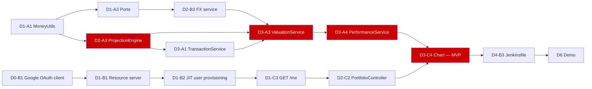

# PLAN.md — Protify Portfolio Manager

Six build days, three developers, one instructor acting as customer.
**Rule that governs every decision below: there is a working demo at the end of every day.**

---

## 1. Shape of the week

| | |
|---|---|
| Day 0 | **Thu 30 Jul 2026** — setup only, separate from the build days |
| Days 1–6 | **Fri 31 Jul → Wed 5 Aug 2026** |
| MVP checkpoint | **End of Day 3** — browse → performance → add → remove, end to end, real Google sign-in, real prices |
| Showcase | **Day 6, afternoon** |
| Capacity | 3 devs × ~6.5 h × 6 days ≈ **117 dev-hours**, plus ~15 h on Day 0 |

Day numbers are the contract; dates are indicative. If weekend days come out, shift the
dates and keep the day numbers. Every task below is sized against a 6.5-hour day, leaving
about an hour of slack per developer per day for merges, review and the daily demo.

**Customer priority order, which the plan follows literally:** browse → view performance →
add → remove. Nothing in Days 1–3 exists that is not on that path.

### The four demos that matter

| End of | The instructor can watch us do this |
|---|---|
| Day 1 | Sign in with a real Google account in a browser; `GET /api/v1/me` returns a user row that did not exist a second ago |
| Day 2 | Create a portfolio, add a BUY, list holdings with a real market price attached |
| Day 3 | **MVP.** Full loop in the React UI: browse portfolio → performance chart → add a transaction → remove one, with USD, INR and GBP instruments valued into one base currency |
| Day 6 | The same, containerised, built by Jenkins, with GraphQL, analytics and AI insights, rehearsed with the wifi off |

---

## 2. Deviations from `/docs/REFERENCE_DESIGN.md` — binding amendments

The reference design is frozen except for the items below. These are **customer decisions
taken after it was written**, not engineering preference. Where they conflict, this section
wins. Everything else in the reference design stands unchanged.

### 2.1 Multi-currency portfolios are now IN scope — reverses §3

REFERENCE_DESIGN §3 says *"Mixed currencies in one portfolio | rejected in v1; FX is a
documented limitation."* **That row is void.** The customer requires a portfolio to hold
AAPL (USD), RELIANCE (INR) and a UK stock (GBP) simultaneously and see everything valued
in a user-chosen base currency at live FX rates.

Consequences, all of which are planned for below:

- New table `fx_rate` (Dev B, `V10`).
- New port `FxRateProvider` in `portfolio-common`, and it must land on **Day 1**, because
  `common` freezes at the end of Day 1.
- `holding.avg_cost` and `txn.price` stay in the **instrument's native currency**. They are
  never rewritten. Base currency is a *presentation* concern resolved at read time, so
  changing a portfolio's base currency changes no stored row — exactly as the customer asked.
- Cost basis, market value, P&L, allocation and the performance series are all computed in
  base currency by **replaying the transaction history through the same projection engine a
  second time with an FX conversion applied at each transaction's date**. One engine, two
  parameterisations. See §5.
- New endpoint `PATCH /portfolios/{id}` to change base currency. §4 of the reference design
  has no update endpoint; it needs one now.

**I flagged this as the single largest scope increase over the reference design** and I am
taking it because the customer stated it explicitly and in detail. It costs roughly 12
developer-hours across Days 1–3. The named fallback if Day 3 runs late is in §9.

### 2.2 `AssetType` gains two values — extends §2

The customer requires mutual funds and Treasury securities in the asset model.

```java
AssetType { STOCK, ETF, MUTUAL_FUND, BOND, TREASURY, CASH, CRYPTO }
```

Persisted as `name()` in the existing `instrument.asset_type VARCHAR(16)`; `MUTUAL_FUND` is
12 characters, so no DDL change. The MVP seeds a representative universe only — the *model*
is unrestricted, the *seed data* is small.

### 2.3 `PriceSource` gains values, and an `FxSource` enum appears — extends §2

```java
PriceSource { YAHOO, TWELVE_DATA, YFINANCE, MANUAL, SEED }   // YAHOO added
FxSource    { FRANKFURTER, MANUAL, SEED }                     // new
```

### 2.4 Testcontainers is retained, and Jenkins is real CI — supersedes the original brief

The original brief assumed no Docker on developer machines and no Jenkins server. Both
assumptions are now false: a Linux VM with Docker **and** a Linux VM with Jenkins are
available, and Docker Desktop can be installed locally. Therefore:

- Testcontainers MySQL integration tests (`*IT`) are the real integration strategy, not a
  best-effort extra. They run in `mvn verify`.
- `mvn clean verify -DskipITs` is the escape hatch for a developer who has not yet installed
  Docker Desktop. It is a convenience, **not** the definition of green.
- **Jenkins on the VM is the pipeline of record.** GitHub Actions is kept as a mirror so
  that a pull request is gated even when the VM is off.

### 2.5 Frontend ownership is fluid — supersedes §5's implicit split

No developer is permanently assigned to React. The API contract freezes at the end of Day 2
so that anyone can pick up frontend work from Day 3 onward. Backend directory ownership in
§5 is unchanged and still strictly enforced.

### 2.6 The performance series is computed in Java, not in SQL — refines §4

The reference design implies a SQL time series. Three flat queries plus an in-memory fold is
easier to test, easier to get right, and removes the single scariest estimate in the plan.
See §5 and `/docs/DECISIONS/0010-performance-series-in-java.md`.

### 2.7 One thing I disagree with and am doing anyway

REFERENCE_DESIGN §3 allows a `BUY` that exceeds available cash, returning a warning. I would
normally reject it — a broker would. The customer confirmed the warning behaviour explicitly
in clarification 6, so **warning it is**, implemented as a `warnings[]` array on the 201
response. Recorded here so the choice is visible at assessment rather than looking like an
oversight.

---

## 3. Modules and ownership

```
portfolio-parent            pom only, owns every version                [Dev A]
├── portfolio-common        ports, MoneyUtils, errors, enums            [Dev A · FROZEN end of Day 1]
├── portfolio-db            Flyway migrations only                      [shared · ADD-ONLY]
├── portfolio-core          instrument portfolio transaction holding
│                           valuation                                   [Dev A]
├── portfolio-platform      config security user marketdata fx          [Dev B]
└── portfolio-api           api graphql PortfolioApplication            [Dev C]
```

`api → {core, platform, common}` · `core → {common, db(test)}` · `platform → {common, db(test)}`.
**`core` must never import `platform`.** It depends on `MarketDataProvider` and
`FxRateProvider` interfaces that live in `common`. This is enforced by the module graph, not
by discipline — a wrong import will not compile.

`portfolio-db` is the one directory all three touch. The Flyway number ranges (A `V1`–`V9`,
B `V10`–`V19`, C `V20`–`V29`) mean everyone only ever *adds* a file, so a merge conflict
there is impossible by construction.

Repositories:

| Repo | Contents |
|---|---|
| `Protify-Backend` | Java modules, `scripts/` (Python backfill), `services/insights/` (FastAPI), `docker/`, `Jenkinsfile` |
| `protify-frontend` | React + Vite |

---

## 4. Task ID scheme

`D<day>-<dev><n>` — e.g. `D2-A3` is Dev A's third task on Day 2.
🔴 = **on the critical path**. 🟢 = **can slip a day without hurting the demo**.

---

## 5. The one design decision everything else rests on

Read this before Day 1. It is why the estimates below are what they are.

The projection engine is a **pure function** in `portfolio-core`:

```java
ProjectionResult project(List<Txn> orderedTxns, ProjectionContext ctx)
```

`ProjectionContext` carries the target currency and an FX lookup
`(Currency from, LocalDate on) -> BigDecimal`. Two call sites:

1. **Native run** — identity FX, target = each instrument's own currency. Result is upserted
   into the `holding` table inside the same DB transaction as the write. This is the
   projection the reference design describes.
2. **Base-currency run** — target = `portfolio.base_currency`, FX resolved at each
   transaction's `executed_at` date. Result feeds valuation, allocation and P&L. Nothing is
   persisted.

The performance series is the same fold with a date cursor: one query for the portfolio's
transactions, one for `price_history` over the range, one for `fx_rate` over the range, then
a single merge-walk producing one point per day.

Three things fall out of this for free, and they are why it is worth doing:

- Changing the base currency provably cannot alter a stored row.
- The "rebuild after a mid-history delete" requirement is the *same code path* as a normal
  write, so it cannot drift.
- The highest-value business logic in the product is a pure function with no Spring, no
  database and no clock — which is where the coverage target gets met cheaply.

---

## 6. Day-by-day

### Day 0 — Setup (Thu 30 Jul) · ~5 h each

Nobody writes application code today. The day is done when all three developers can run the
same green build against their own MySQL.

| ID | Owner | Task | Files | Acceptance | Tests | h | Depends on |
|---|---|---|---|---|---|---|---|
| D0-A1 🔴 | A | Maven skeleton: parent + 5 modules, Java 21, Spring Boot 3.5.16, all versions pinned in parent `dependencyManagement` | `pom.xml`, `portfolio-{common,db,core,platform,api}/pom.xml` | `mvn clean verify` green on empty modules | build itself | 2.0 | — |
| D0-A2 🔴 | A | Local MySQL 8.4: `portfolio` + `portfolio_test` schemas, dedicated user, `?serverTimezone=UTC` JDBC URL proven | `docs/DEV_SETUP.md` | `SELECT VERSION()` ≥ 8.4 from all three machines | manual | 1.0 | — |
| D0-A3 | A | Git: `main` protected, `develop` cut, branch naming, PR template, `.gitignore` (keep `docs` ignored) | `.github/pull_request_template.md`, `.gitignore` | Direct push to `main` is rejected | — | 1.0 | — |
| D0-A4 | A | Agree §2 deviations with B and C, walk the team through §5 | — | Both devs can restate why `core` cannot import `platform` | — | 1.0 | D0-B1, D0-C1 |
| D0-B1 🔴 | B | **Google Cloud project + OAuth 2.0 Web client**, consent screen External/Testing, 4 test users (3 devs + instructor), redirect origins for `localhost:5173` | `.env.example` | A client ID exists and a real ID token can be minted from the OAuth playground | manual | 2.0 | — |
| D0-B2 | B | Docker: verify Linux VM daemon, install Docker Desktop where possible, `docker run mysql:8.4` succeeds | `docs/DEV_SETUP.md` | At least 2 of 3 machines can run Testcontainers | `docker run hello-world` | 1.5 | — |
| D0-B3 | B | Jenkins VM reachable, credentials issued, GitHub webhook or poll configured | `docs/DEV_SETUP.md` | Jenkins can clone the repo | — | 1.5 | D0-A3 |
| D0-C1 🔴 | C | React + Vite scaffold in `protify-frontend`, `@react-oauth/google` installed, dev server up | `protify-frontend/*` | `npm run dev` serves a page | — | 2.0 | — |
| D0-C2 | C | GitHub Actions workflow: JDK 21, `mvn -B clean verify`, cache | `.github/workflows/ci.yml` | Green on the skeleton | the build | 1.5 | D0-A1 |
| D0-C3 | C | Python 3.11 venv, `yfinance` + `requests` installed, one manual price fetch proven | `scripts/requirements.txt` | `yf.Ticker("AAPL").history(period="5d")` returns rows | manual | 1.0 | — |

**Day 0 exit criteria — do not start Day 1 until all four are true:**
1. `mvn clean verify` is green on all three machines.
2. A real Google ID token has been obtained by hand and pasted into a text file.
3. Everyone can reach the Jenkins VM and the Docker VM.
4. All three have read §2 of this document and agreed it.

---

### Day 1 — Foundations, auth, and the error contract

> **Hard deadline: `portfolio-common` freezes at end of day.** Every port, every enum and
> `MoneyUtils` must be in `develop` by then. This is the tightest constraint of the week.

#### Dev A — `common` and the baseline schema · 6.5 h

| ID | Task | Files | Acceptance | Tests | h | Depends |
|---|---|---|---|---|---|---|
| D1-A1 🔴 | `MoneyUtils`: scale 4 for money / 6 for quantity / 8 for FX, `HALF_UP`, `isZero`, `isNegative`, safe `divide`, `pctChange` returning `null` on zero base | `common/money/MoneyUtils.java`, `common/money/Money.java` (record: amount + currency) | Every rounding decision in the codebase resolves here | `MoneyUtilsTest` — 12 cases incl. zero-denominator → `null` | 1.5 | — |
| D1-A2 🔴 | Enums per §2.2/§2.3, each with `fromDbValue(String)` returning `Optional` — never `valueOf` in a RowMapper | `common/enums/*.java` | Unknown DB string yields a logged warning, not an exception | `EnumMappingTest` — unknown value on every enum | 0.75 | — |
| D1-A3 🔴 | **Ports**: `MarketDataProvider`, `FxRateProvider`, `Clock` supplier | `common/port/MarketDataProvider.java`, `common/port/FxRateProvider.java` | Dev B can implement them without touching `core` | compile-only | 0.75 | D0-A4 |
| D1-A4 🔴 | Exception hierarchy: `DomainException` + `NotFound`/`Validation`/`InsufficientQuantity`/`CurrencyMismatch`/`Upstream`, each carrying a `problemType` slug | `common/error/*.java` | Dev C maps every one without a default branch | `DomainExceptionTest` | 0.75 | — |
| D1-A5 🔴 | `V1__baseline.sql` exactly as REFERENCE_DESIGN §1 | `portfolio-db/.../V1__baseline.sql` | Flyway applies clean on an empty schema | `FlywayMigrationIT` (Testcontainers) | 1.0 | D0-A1 |
| D1-A6 | `V2__seed_instruments.sql` — 18 instruments across USD/INR/GBP/EUR and 6 asset types | `portfolio-db/.../V2__seed_instruments.sql` | `SELECT COUNT(*) FROM instrument` = 18, ≥ 3 currencies, ≥ 4 asset types | `SeedDataIT` | 0.75 | D1-A5 |
| D1-A7 | `BaseRepository` with the `KeyHolder` + `RETURN_GENERATED_KEYS` insert helper written **once** | `core/support/BaseRepository.java` | No other class constructs a `KeyHolder` | `BaseRepositoryIT` | 1.0 | D1-A5 |

#### Dev B — Security and the user · 6.5 h

| ID | Task | Files | Acceptance | Tests | h | Depends |
|---|---|---|---|---|---|---|
| D1-B1 🔴 | OAuth2 resource server: issuer `https://accounts.google.com`, audience = `GOOGLE_CLIENT_ID`, everything authenticated except `/actuator/health`, `/v3/api-docs/**`, `/swagger-ui/**` | `platform/security/SecurityConfig.java` | A hand-minted real Google token gets 200; a tampered one gets 401 | `SecurityConfigTest`, `UnauthorisedAccessIT` | 2.0 | D0-B1 |
| D1-B2 🔴 | `CurrentUserResolver`: `sub` → `app_user` lookup, JIT insert on first sight, rejects `email_verified=false`, exposes internal `userId` as a request-scoped bean | `platform/user/CurrentUserResolver.java`, `AppUserRepository.java`, `AppUserRowMapper.java` | Second call with the same token creates no second row | `CurrentUserResolverTest`, `JitProvisioningIT` | 2.0 | D1-B1, D1-A5 |
| D1-B3 🔴 | `application.yml` + `application-local.yml` + `.env.example`; every secret an env var with a safe local default | `portfolio-api/src/main/resources/application*.yml`, `.env.example` | `git grep` finds no client ID, key or password | `ConfigurationSmokeTest` | 1.0 | D0-B1 |
| D1-B4 | Correlation-ID filter: read `X-Correlation-Id` or mint a UUID, into MDC, echo on the response | `platform/web/CorrelationIdFilter.java` | Every log line in a request carries the same id | `CorrelationIdFilterTest` | 1.0 | D1-A4 |
| D1-B5 🟢 | Structured logging config, `TRACE` on our packages in local profile | `logback-spring.xml` | Logs are greppable by correlation id | — | 0.5 | D1-B4 |

#### Dev C — App shell, error contract, first endpoint · 6.5 h

| ID | Task | Files | Acceptance | Tests | h | Depends |
|---|---|---|---|---|---|---|
| D1-C1 🔴 | `PortfolioApplication`, `/api/v1` base path, CORS for `localhost:5173` | `api/PortfolioApplication.java`, `api/config/WebConfig.java` | App boots, `/actuator/health` returns 200 UP | `ApplicationContextLoadsTest` | 1.0 | D0-A1 |
| D1-C2 🔴 | `GlobalExceptionHandler`: RFC 9457 `ProblemDetail`, `correlationId`, `errors[]` for field violations, handlers for all of `DomainException`, `MethodArgumentNotValidException`, `AuthenticationException`, `AccessDeniedException`, `Exception` | `api/error/GlobalExceptionHandler.java` | No response body anywhere contains a stack trace, SQL fragment or `com.protify` | `GlobalExceptionHandlerTest` — 8 cases incl. a deliberate NPE | 2.5 | D1-A4, D1-B4 |
| D1-C3 🔴 | `GET /api/v1/me` — the whole vertical slice, end to end | `api/user/MeController.java`, `api/dto/UserResponse.java`, `api/mapper/UserMapper.java` | Real Google token in a browser returns the profile and creates the row | `MeControllerTest` (happy/401), `MeControllerIT` | 1.5 | D1-B2, D1-C2 |
| D1-C4 | springdoc-openapi with a Bearer security scheme; Swagger UI unauthenticated | `api/config/OpenApiConfig.java` | `/swagger-ui/index.html` loads and has an Authorize button | `OpenApiDocsTest` | 1.0 | D1-C1 |
| D1-C5 🟢 | Frontend: Google sign-in button, token held in memory, `/me` called and rendered | `protify-frontend/src/auth/*`, `src/App.tsx` | Name and picture appear after sign-in | — | 0.5 | D1-C3, D0-C1 |

**Day 1 demo:** sign in with a real Google account, see your user row appear in MySQL, then
show a 401 with a clean ProblemDetail body for a bad token.

---

### Day 2 — Browse (customer priority 1)

#### Dev A — Domain and the projection engine · 6.5 h

| ID | Task | Files | Acceptance | Tests | h | Depends |
|---|---|---|---|---|---|---|
| D2-A1 🔴 | `PortfolioRepository` + `PortfolioService`. **Every method takes `userId` as its first argument** | `core/portfolio/*.java` | No query in the file lacks `WHERE user_id = :userId` | `PortfolioRepositoryIT` incl. cross-user | 1.5 | D1-A7 |
| D2-A2 🔴 | `InstrumentRepository` + search by symbol/name prefix, paged | `core/instrument/*.java` | `?query=re` returns RELIANCE, ranked by symbol prefix first | `InstrumentRepositoryIT` | 1.0 | D1-A6 |
| D2-A3 🔴 | **`ProjectionEngine`** — the pure fold of §5. BUY / SELL / DIVIDEND / DEPOSIT / WITHDRAWAL / FEE, weighted-average cost, realised P&L, cash balance, sell-to-zero keeps the row at qty 0 | `core/holding/ProjectionEngine.java`, `HoldingState.java`, `ProjectionContext.java` | Given the same txn list it always yields the same result; no Spring, no DB, no clock | `ProjectionEngineTest` — **18 cases**, this is the crown-jewel test class | 2.5 | D1-A1, D1-A2 |
| D2-A4 🔴 | `TransactionRepository` + `HoldingRepository` with `INSERT … ON DUPLICATE KEY UPDATE` upsert | `core/transaction/*.java`, `core/holding/HoldingRepository.java` | Upsert is idempotent under repeat | `TransactionRepositoryIT`, `HoldingRepositoryIT` | 1.5 | D2-A1 |

#### Dev B — Market data and FX · 6.5 h

| ID | Task | Files | Acceptance | Tests | h | Depends |
|---|---|---|---|---|---|---|
| D2-B1 🔴 | `YahooMarketDataProvider` (keyless chart endpoint) + `TwelveDataMarketDataProvider` (key from env, disabled if absent), selected by config. `RestClient`, 3 s timeout, 1 retry | `platform/marketdata/provider/*.java` | Swapping the provider is a config change, no code change | `YahooMarketDataProviderTest` with MockRestServiceServer | 2.0 | D1-A3 |
| D2-B2 🔴 | `CachingMarketDataService`: Caffeine, 15-min TTL for latest, then `price_history` last-good, then seed. Never throws on provider failure — degrades and reports `priceAsOf` | `platform/marketdata/CachingMarketDataService.java`, `PriceHistoryRepository.java` | Kill the network mid-demo and prices still resolve | `CachingMarketDataServiceTest` — provider throws, cache empty, DB has a row | 2.0 | D2-B1 |
| D2-B3 🔴 | `V10__fx_rate.sql` + `FrankfurterFxRateProvider` + `CachingFxRateService`. USD pivot, cross rates derived, 6-hour TTL, last-good fallback | `portfolio-db/.../V10__fx_rate.sql`, `platform/fx/*.java` | `convert(100 USD → INR, today)` returns a real rate; with the network off it returns the last stored one and flags `rateAsOf` | `FxRateServiceTest`, `FxRateRepositoryIT` | 2.0 | D1-A3, D1-A5 |
| D2-B4 | Python backfill: 2 years of daily closes for all 18 seeded instruments → `V11__seed_price_history.sql`; plus 2 years of daily FX → `V12__seed_fx_rate.sql` | `scripts/backfill_prices.py`, `portfolio-db/.../V11__*.sql`, `V12__*.sql` | Re-running the script is idempotent; migrations use `INSERT IGNORE` | `SeedPriceHistoryIT` — every seeded instrument has ≥ 480 rows | 0.5 | D1-A6 |

#### Dev C — The browse API and the UI list · 6.5 h

| ID | Task | Files | Acceptance | Tests | h | Depends |
|---|---|---|---|---|---|---|
| D2-C1 🔴 | DTOs as records with Bean Validation: `CreatePortfolioRequest`, `PortfolioResponse`, `MoneyDto`, `PageResponse<T>`. **Money serialises as `{"amount":"1234.5600","currency":"INR"}` with amount as a string** | `api/dto/*.java` | No `BigDecimal` reaches JSON as a float | `MoneySerializationTest` | 1.5 | D1-C2 |
| D2-C2 🔴 | `PortfolioController`: GET list, POST create (201 + `Location`), GET by id, DELETE (204) | `api/portfolio/PortfolioController.java`, `api/mapper/PortfolioMapper.java` | Four status codes, all four test types each | `PortfolioControllerTest` — 16 cases | 2.0 | D2-A1, D2-C1 |
| D2-C3 🔴 | `InstrumentController`: `GET /instruments?query=` | `api/instrument/InstrumentController.java` | Type-ahead returns ≤ 20 results in < 200 ms | `InstrumentControllerTest` | 1.0 | D2-A2 |
| D2-C4 🔴 | **Freeze `/docs/API_CONTRACT.md`** against what actually shipped and tell the team | `docs/API_CONTRACT.md` | Every field in the doc exists in code and vice versa | — | 0.5 | D2-C2 |
| D2-C5 | Frontend: portfolio list page, create-portfolio form, auth interceptor that retries once on 401 | `protify-frontend/src/pages/Portfolios.tsx`, `src/api/client.ts` | Create a portfolio in the browser | — | 1.5 | D2-C2 |

**Day 2 demo:** in the browser, sign in, create "Growth", search for RELIANCE, and show a
live INR price coming back from a real provider.

---

### Day 3 — Performance, add, remove · **MVP CHECKPOINT**

#### Dev A — Valuation, FX conversion, performance series · 6.5 h

| ID | Task | Files | Acceptance | Tests | h | Depends |
|---|---|---|---|---|---|---|
| D3-A1 🔴 | `TransactionService.record()` — validate, reject SELL > holding with `422 /errors/insufficient-quantity`, reject unknown symbol with 404 **before any write**, warn on BUY over cash, run the native projection and upsert holdings, **all in one `@Transactional`** | `core/transaction/TransactionService.java` | A failed projection rolls back the txn insert | `TransactionServiceTest` — 10 cases | 2.0 | D2-A3, D2-A4 |
| D3-A2 🔴 | `TransactionService.delete()` — delete then **full rebuild** of that portfolio's projection from `txn`, under `SELECT … FOR UPDATE` on the portfolio row | same file | Deleting the first of five transactions leaves holdings identical to a from-scratch replay of the remaining four | `MidHistoryDeleteIT` — the assessor's favourite test | 1.0 | D3-A1 |
| D3-A3 🔴 | `ValuationService` — base-currency run of the projection engine, market value / cost basis / cash / unrealised P&L / P&L %, `null` when cost basis is zero, `priceAsOf` + `rateAsOf` surfaced | `core/valuation/ValuationService.java` | A portfolio of AAPL(USD) + RELIANCE(INR) + a GBP stock totals correctly in INR | `ValuationServiceTest` — 12 cases incl. zero cost basis and missing price | 2.0 | D2-A3, D2-B3 |
| D3-A4 🔴 | `PerformanceService` — three queries plus the merge-walk fold of §5, one point per day, gap-filled forward over weekends and holidays | `core/valuation/PerformanceService.java` | 90 days of series for a 3-currency portfolio in < 300 ms | `PerformanceServiceTest` — 8 cases incl. a txn on a market holiday | 1.5 | D3-A3 |

#### Dev B — Refresh, scheduling, resilience · 6.5 h

| ID | Task | Files | Acceptance | Tests | h | Depends |
|---|---|---|---|---|---|---|
| D3-B1 🔴 | Daily price refresh `@Scheduled` writing into `price_history`, plus `POST /admin/prices/refresh` service side | `platform/marketdata/PriceRefreshScheduler.java` | Refresh twice in a row inserts no duplicate `(instrument_id, price_date)` | `PriceRefreshSchedulerTest`, `PriceRefreshIT` | 1.5 | D2-B2 |
| D3-B2 🔴 | 429 / rate-limit handling: token bucket sized to the provider's free tier, exponential backoff, circuit breaker that opens for 5 min after 3 consecutive failures and serves cached data throughout | `platform/marketdata/RateLimitedProvider.java` | 50 rapid symbol requests never exceed the provider quota and never produce a 5xx to our caller | `RateLimitedProviderTest` — simulated 429 | 2.0 | D2-B1 |
| D3-B3 🔴 | FX daily refresh + historical backfill on demand for any date the series needs | `platform/fx/FxRefreshScheduler.java` | Asking for a rate on a date we have never seen fetches and stores it, once | `FxRefreshSchedulerTest` | 1.5 | D2-B3 |
| D3-B4 | `/actuator/health` custom indicators: db, marketdata, fx — degraded rather than down when a provider is cold | `platform/health/*.java` | Health stays UP with the network off, with `"marketdata":"DEGRADED"` | `HealthIndicatorTest` | 1.0 | D3-B1 |
| D3-B5 🟢 | `docs/DEMO_SCRIPT.md` first draft | `docs/DEMO_SCRIPT.md` | Someone else can run the demo from it | — | 0.5 | — |

#### Dev C — Performance, add, remove — the customer's four verbs · 6.5 h

| ID | Task | Files | Acceptance | Tests | h | Depends |
|---|---|---|---|---|---|---|
| D3-C1 🔴 | `TransactionController` POST (201 + `Location` + `warnings[]`), GET paged and filterable by type and date range, DELETE (204) | `api/transaction/TransactionController.java`, `dto/CreateTransactionRequest.java`, `TransactionResponse.java` | Bean Validation rejects qty ≤ 0 and a future `executedAt` | `TransactionControllerTest` — 20 cases | 2.0 | D3-A1, D3-A2 |
| D3-C2 🔴 | `HoldingController` + `ValuationController` — `/holdings`, `/valuation?asOf=`, both in base currency with an optional `?currency=` presentation override | `api/holding/HoldingController.java`, `api/valuation/ValuationController.java` | Same portfolio rendered in INR and USD from one dataset | `HoldingControllerTest`, `ValuationControllerTest` | 1.5 | D3-A3 |
| D3-C3 🔴 | `PerformanceController` — `/performance?from=&to=` | `api/valuation/PerformanceController.java` | Rejects `from > to` with 400 and a field error | `PerformanceControllerTest` | 0.5 | D3-A4 |
| D3-C4 🔴 | Frontend: performance chart (Recharts), holdings table, add-transaction form with symbol type-ahead, delete with confirm | `protify-frontend/src/pages/PortfolioDetail.tsx`, `src/components/PerformanceChart.tsx` | **The full customer loop works in a browser** | manual + one Vitest render test | 2.5 | D3-C1, D3-C2, D3-C3 |

**🏁 END OF DAY 3 — MVP.** Browse → performance → add → remove, real Google auth, real
prices, three currencies into one base currency. **Tag it `v0.1-mvp` and stop.** If Day 3
ends without this, execute §9 before starting Day 4.

---

### Day 4 — Hardening, containers, and making it real

#### Dev A — Edge cases and the coverage gate · 6.5 h

| ID | Task | Files | Acceptance | Tests | h | Depends |
|---|---|---|---|---|---|---|
| D4-A1 🔴 | Every edge case in `/docs/TEST_PLAN.md` §4 that is still red | `core/**/*Test.java` | All ten named edge cases pass | the ten named tests | 2.5 | Day 3 |
| D4-A2 🔴 | Optimistic concurrency on the projection: `SELECT … FOR UPDATE` on `portfolio`, proven under two parallel writers | `core/transaction/TransactionService.java` | Two concurrent BUYs of the same instrument produce quantity 2, never 1 | `ConcurrentWriteIT` with a `CountDownLatch` | 1.5 | D4-A1 |
| D4-A3 | JaCoCo at **70 % line / 60 % branch**, gate ON, DTO/config/generated excluded | `pom.xml` | `mvn clean verify` fails if coverage drops | the build | 1.0 | D4-A1 |
| D4-A4 | `AllocationService` — by asset type, by sector, by currency, all in base currency | `core/valuation/AllocationService.java` | Weights sum to 1.0000 ± 0.0001 | `AllocationServiceTest` | 1.5 | D3-A3 |

#### Dev B — Docker and Jenkins · 6.5 h

| ID | Task | Files | Acceptance | Tests | h | Depends |
|---|---|---|---|---|---|---|
| D4-B1 🔴 | Multi-stage `Dockerfile` (build → JRE 21 slim, non-root user, layered jar) | `docker/Dockerfile` | Image < 400 MB, boots in the VM | `docker run` smoke | 2.0 | Day 3 |
| D4-B2 🔴 | `compose.yml`: mysql 8.4 + api + healthchecks + named volume; Flyway runs on boot | `docker/compose.yml`, `.env.example` | `docker compose up` from a clean volume gives a working API | manual smoke script | 1.5 | D4-B1 |
| D4-B3 🔴 | `Jenkinsfile`: checkout → build → unit → IT (Testcontainers) → JaCoCo publish → package → docker build → archive. Declarative, stages visible | `Jenkinsfile` | **A real push triggers a real green run on the VM** | the pipeline is the test | 2.5 | D4-B2 |
| D4-B4 | GitHub Actions updated to mirror the Jenkins stages | `.github/workflows/ci.yml` | Both CIs agree on green | — | 0.5 | D4-B3 |

#### Dev C — Frontend completion and cross-user proof · 6.5 h

| ID | Task | Files | Acceptance | Tests | h | Depends |
|---|---|---|---|---|---|---|
| D4-C1 🔴 | **`CrossUserAccessIT`** — user A cannot read, update or delete any of user B's portfolios, transactions, holdings, valuations or performance. One parameterised test over every scoped endpoint | `api/security/CrossUserAccessIT.java` | Every endpoint returns 404 (not 403 — we do not confirm existence) | the test itself | 1.5 | Day 3 |
| D4-C2 🔴 | Frontend: allocation pie, base-currency switcher, empty states, error toasts driven by `ProblemDetail.title` | `protify-frontend/src/**` | Switching INR→USD re-renders every number | Vitest | 2.5 | D4-A4 |
| D4-C3 | Loading skeletons, optimistic delete with rollback, mobile layout | `protify-frontend/src/**` | Usable at 390 px wide | — | 1.5 | D4-C2 |
| D4-C4 | `PATCH /portfolios/{id}` for base-currency change | `api/portfolio/PortfolioController.java` | Changing base currency alters no `txn` or `holding` row — asserted | `PatchPortfolioTest`, `BaseCurrencyImmutabilityIT` | 1.0 | D3-C2 |

**Day 4 demo:** the whole app running from `docker compose up`, built by a green Jenkins run,
plus the cross-user test going red when the `WHERE user_id` clause is deliberately removed.

---

### Day 5 — Showcase features

Everything on Day 5 is 🟢 by definition. If Day 4 slipped, Day 5 is the buffer — spend it on
Day 4's list without guilt.

| ID | Owner | Task | Files | Acceptance | Tests | h | Depends |
|---|---|---|---|---|---|---|---|
| D5-A1 🟢 | A | Analytics: TWR, simple annualised return, max drawdown, best/worst day | `core/valuation/AnalyticsService.java` | TWR over a known series matches a hand-computed figure | `AnalyticsServiceTest` with a fixture from a spreadsheet | 3.0 | D3-A4 |
| D5-A2 🟢 | A | `portfolio_valuation_daily` materialisation + nightly job, series reads prefer it | `core/valuation/ValuationSnapshotService.java` | 365-day series drops below 100 ms | `ValuationSnapshotIT` | 2.0 | D5-A1 |
| D5-A3 🟢 | A | Performance tuning pass: indexes, N+1 hunt, batch price lookups | `V3__perf_indexes.sql` | No endpoint over 500 ms with 500 transactions | `PerformanceBudgetIT` | 1.5 | D5-A2 |
| D5-B1 🟢 | B | **FastAPI insights service** — `POST /insights` takes a portfolio summary, returns an LLM narrative; **canned deterministic response when no API key or no network** | `services/insights/{main.py,Dockerfile,requirements.txt}` | Works with the key removed | `test_insights.py` incl. the offline path | 3.0 | Day 4 |
| D5-B2 🟢 | B | Java client for it behind a feature flag, `POST /portfolios/{id}/insights`, 2 s timeout, falls back to a rule-based summary | `platform/insights/InsightsClient.java` | Flag off ⇒ endpoint 501 with a clean ProblemDetail; service down ⇒ rule-based text, never a 500 | `InsightsClientTest` | 2.0 | D5-B1 |
| D5-B3 🟢 | B | Insights service added to compose and to the Jenkins pipeline | `docker/compose.yml`, `Jenkinsfile` | One `docker compose up` brings up all three containers | pipeline | 1.5 | D5-B2 |
| D5-C1 🟢 | C | **GraphQL**: schema + resolvers for the read paths, same security context, `@PreAuthorize` equivalent, depth limit 6 | `api/graphql/schema.graphqls`, `api/graphql/*Resolver.java` | GraphiQL query returning portfolio + holdings + performance in one round trip | `GraphQlQueryTest` incl. an unauthorised query | 3.0 | Day 4 |
| D5-C2 🟢 | C | Frontend: analytics panel, insights card, CSV export | `protify-frontend/src/**` | Analytics render from the real endpoint | Vitest | 2.5 | D5-A1, D5-B2 |
| D5-C3 🟢 | C | README with architecture diagram and a five-minute quickstart | `README.md` | A stranger gets it running from the README alone | someone outside the team tries it | 1.0 | — |

---

### Day 6 — Freeze, prove, present

**Feature freeze at midday. Nothing merges after 13:00 except a fix for a demo-blocking bug.**

| ID | Owner | Task | Acceptance | h |
|---|---|---|---|---|
| D6-A1 🔴 | A | `V4__demo_seed.sql` — a demo portfolio, 3 currencies, ~25 transactions over 18 months, deterministic | Fresh DB → `docker compose up` → the demo portfolio is already interesting | 1.5 |
| D6-A2 🔴 | A | Full-rebuild proof: rebuild every projection from `txn` and assert zero diff against live tables | `ProjectionRebuildConsistencyIT` green | 1.0 |
| D6-A3 | A | Final `mvn clean verify` on a clean clone; coverage report archived | Green from `git clone` on a machine that has never built it | 1.0 |
| D6-B1 🔴 | B | **Offline dry-run: wifi off, whole demo start to finish** | Every screen renders; `priceAsOf`/`rateAsOf` visibly go stale but nothing errors | 1.5 |
| D6-B2 🔴 | B | Final Jenkins run from a clean workspace, artefacts published | Green, with the JaCoCo trend visible | 1.0 |
| D6-B3 | B | Secret sweep: `git log -p` and `git grep` for keys, tokens, client IDs | Nothing found; `.env` never committed | 1.0 |
| D6-C1 🔴 | C | Demo rehearsal ×2, timed, with a deliberate error case shown | Under 10 minutes, and the failure path is shown on purpose | 2.0 |
| D6-C2 🔴 | C | Slides: architecture, ADR highlights, what we cut and why | The "what we cut" slide exists — it is the one that gets marks | 2.0 |
| D6-C3 | C | Final `/docs/` sweep — every ADR reflects what was actually built | No ADR contradicts the code | 1.0 |

---

## 7. Critical path



**The path is: OAuth client → resource server → user resolution → projection engine →
valuation with FX → performance series → chart.** Everything else can be worked around.

Two chokepoints deserve naming:

1. **`portfolio-common` freezing at end of Day 1.** `MoneyUtils`, the enums and both ports
   must be merged to `develop` by then or Days 2 and 3 stall for two developers.
2. **`ProjectionEngine` (D2-A3).** Dev C's controllers and Dev B's valuation inputs both
   queue behind it. It is scheduled early on Day 2 for that reason, and it has no
   dependencies beyond `common` precisely so it cannot be blocked.

---

## 8. Tasks that can slip a day without hurting the demo

`D1-B5` logging config · `D2-B4` seed backfill (can be same-day-generated) · `D3-B4` health
indicators · `D3-B5` demo script draft · `D4-C3` mobile layout · **all of Day 5**.

Day 5 in its entirety is the schedule buffer. If Days 1–4 run clean, Day 5 delivers GraphQL,
analytics and AI insights. If they do not, Day 5 absorbs the overflow and we present a
smaller, working product — which scores better than a larger, broken one.

---

## 9. Descope ladder — cut in this order, top first

Trigger: **the end of Day 3 arrives without the MVP demo working.** Cut in order until it does.

| # | Cut | Saves | Cost of cutting |
|---|---|---|---|
| 1 | Allocation endpoint + pie chart | 3 h | Nothing on the customer's four verbs |
| 2 | GraphQL | 3 h | A mandated-tech tick — mitigate with an SDL + a written ADR explaining the deferral |
| 3 | FastAPI insights service | 6.5 h | A stretch goal the customer already called optional |
| 4 | Intraday price refresh — daily close only | 3.5 h | Prices are one day stale; the chart is unaffected |
| 5 | **FX at trade date → FX at latest rate for cost basis** | 4 h | P&L stops separating FX effect from market effect. Document it loudly as a known limitation |
| 6 | Multi-currency entirely — single base currency per portfolio, reject mismatches | 12 h | Reverts to REFERENCE_DESIGN §3 as originally written. **Last resort.** |
| 7 | Performance chart | 5 h | **Never cut this.** It is customer priority 2. Cut Day 4 and 5 work instead |

Note the shape: cuts 1–4 are additive features nobody promised. Cut 5 is a fidelity
reduction inside a feature that still works. Only cut 6 removes something the customer asked
for, and if we reach it we tell them on Day 4, not on Day 6.

---

## 10. Mandated technology by day

| Technology | D0 | D1 | D2 | D3 | D4 | D5 | D6 |
|---|:--:|:--:|:--:|:--:|:--:|:--:|:--:|
| Java 21 | ✅ | | | | | | |
| Spring Boot 3.5.16 | ✅ | | | | | | |
| Maven multi-module | ✅ | | | | | | |
| MySQL 8.4 | ✅ | | | | | | |
| Flyway | | ✅ | | | | | |
| `NamedParameterJdbcTemplate` + hand-written RowMappers | | ✅ | | | | | |
| Spring Security OAuth2 resource server | | ✅ | | | | | |
| Google Sign-In, real tokens | | ✅ | | | | | |
| RFC 9457 ProblemDetail + correlation ID | | ✅ | | | | | |
| springdoc-openapi | | ✅ | | | | | |
| Bean Validation on record DTOs | | | ✅ | | | | |
| Real market-data integration + cache | | | ✅ | | | | |
| Real FX integration + cache | | | ✅ | | | | |
| Python (yfinance backfill) | | | ✅ | | | | |
| Transaction-centric projection | | | ✅ | | | | |
| Multi-currency valuation | | | | ✅ | | | |
| `@Transactional` + row locking | | | | ✅ | | | |
| Scheduling + rate limiting + circuit breaking | | | | ✅ | | | |
| React + Vite frontend | | | | ✅ | | | |
| Testcontainers integration tests | | | | | ✅ | | |
| JaCoCo coverage gate | | | | | ✅ | | |
| Docker multi-stage + compose | | | | | ✅ | | |
| **Jenkins pipeline (real run)** | | | | | ✅ | | |
| GitHub Actions | ✅ | | | | ✅ | | |
| GraphQL | | | | | | ✅ | |
| Python FastAPI + LLM | | | | | | ✅ | |
| Offline-resilient demo | | | | | | | ✅ |

Quantum optimisation is **cut on Day 0**, deliberately and in writing. It is a stretch goal
attached to no customer requirement, and the honest engineering answer — that a 4-asset
QAOA toy adds nothing a mean-variance optimiser does not already do better — is worth more
at assessment than a half-working notebook. `/docs/DECISIONS/0009-quantum-cut.md` says so
properly.

---

## 11. Rituals

- **09:00 stand-up, 10 minutes**, three questions: what merged yesterday, what blocks me,
  what am I demoing tonight.
- **Merge to `develop` by 17:30 daily.** A branch that has not merged in 24 hours is an
  escalation, not a style issue.
- **17:45 demo**, on `develop`, from a clean start. Whoever's task it was drives.
- **Every PR needs one review** from a developer who does not own that directory.
- If a task needs a change outside your area: **stop and ask in the channel**. Do not edit.
