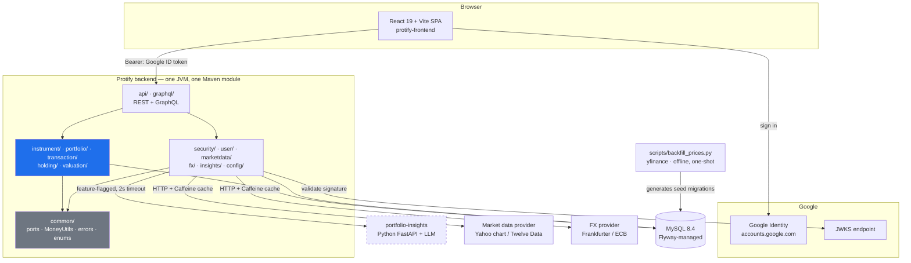
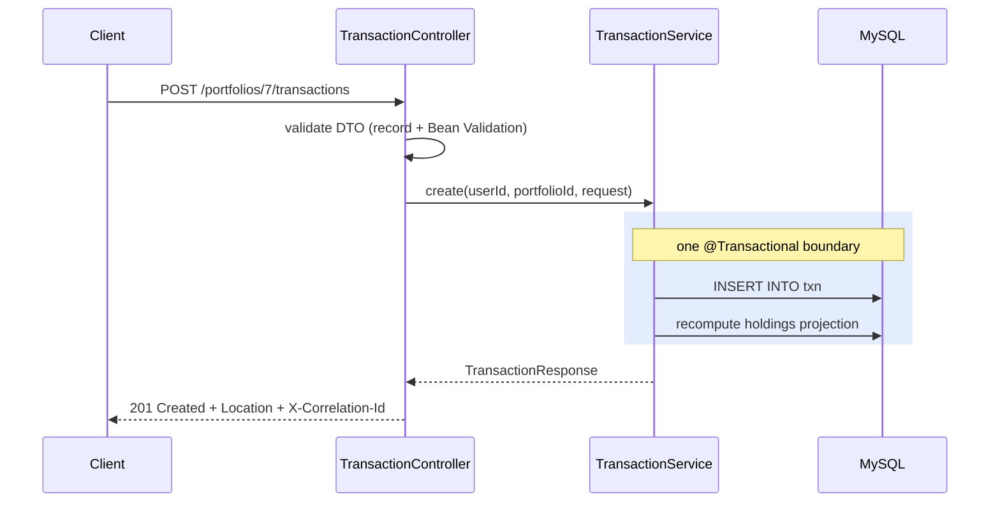

<div align="center">

# 📈 Protify

### Multi-currency portfolio management, built transaction-first.

*A production-shaped Portfolio Management platform — **Java 21 · Spring Boot 3.5 · MySQL 8.4 · REST + GraphQL · React 19** — that turns a ledger of trades into live valuation, performance and allocation, in any currency, without ever losing a cent to floating-point rounding.*

<br/>

[](https://github.com/Neueda-Learning/11_105_portfoliomanagement_Portify/actions/workflows/ci.yml)


<br/>

**`portfolio management` · `fintech` · `spring-boot` · `rest-api` · `graphql` · `oauth2` · `multi-currency` · `market-data` · `time-weighted-return` · `flyway` · `testcontainers` · `docker` · `react` · `typescript`**

[Quickstart](#-quickstart-5-minutes-with-docker) · [Features](#-features) · [Architecture](#-architecture) · [API](#-api-reference) · [Testing](#-testing--quality-gates) · [Authors](#-authors--credits)

</div>

---

## ✨ What is Protify?

**Protify is a portfolio management API for people who hold stocks, ETFs and funds across more than one currency.** It projects every buy, sell, deposit, withdrawal, fee and dividend into live market value, cost basis and profit-and-loss — in the instrument's own currency *and* in the portfolio's base currency. A React single-page app on top turns that into a browsable portfolio: a value chart, an allocation breakdown, an analytics panel and a transaction ledger a customer can add to and trust.

The design decision everything else follows from: **transactions are the source of truth, holdings are a projection.** Nothing mutates a position in place. Post a transaction and the holdings projection is recomputed inside the *same* database transaction — which means the entire portfolio can be rebuilt from the ledger at any time and arrive at exactly the same numbers. That is what makes the balances auditable rather than merely plausible.

> This repository is the **backend**. The React frontend lives alongside it in [`protify-frontend/`](protify-frontend/) — same repo, same history, no second clone required.

<table>
<tr>
<td width="33%" valign="top">

**🎯 Built for correctness**

`BigDecimal` end to end, `DECIMAL(19,4)` money in MySQL, decimal **strings** in JSON. No `double` ever touches a financial calculation.

</td>
<td width="33%" valign="top">

**🔌 Built for offline**

Every external call has a fallback chain. Unplug the network mid-demo and the product keeps answering with cached, then last-good, then seeded data.

</td>
<td width="33%" valign="top">

**🔒 Built for isolation**

Every query touching user data is scoped to the authenticated user's ID. Another user's resource is a **404**, never a 403 — no existence leaks.

</td>
</tr>
</table>

---

## 🚀 Features

### 💼 Portfolio & ledger

| | |
|---|---|
| **Multiple portfolios per user** | Each with its own name and base currency (`USD`, `EUR`, `GBP`, `INR`) |
| **Full transaction ledger** | `BUY` · `SELL` · `DIVIDEND` · `DEPOSIT` · `WITHDRAWAL` · `FEE`, paginated, newest first |
| **Holdings as a projection** | Recomputed in the same DB transaction as every write — always reproducible by a full rebuild |
| **Weighted-average cost basis** | Deterministic, explainable, and cheap to verify by hand (ADR-0005) |
| **Base-currency switching** | `PATCH` the portfolio and every read re-presents in the new currency — stored values never change |
| **Guarded sells** | Selling more than you hold is a clean `422` with a machine-readable reason, not a corrupted position |

### 📊 Valuation & analytics

| | |
|---|---|
| **Live market valuation** | Market value, cost basis, cash balance, total value, unrealised & realised P&L |
| **Performance time series** | Daily / weekly / monthly points over any window, with a start-vs-end summary |
| **Analytics panel** | Time-weighted return (TWR), annualised return, max drawdown, best & worst day |
| **Allocation breakdown** | Slice by asset type, sector, currency or instrument — with weights that sum to 100% |
| **Staleness is visible** | Every response carries `priceAsOf` / `rateAsOf` / `stale`; the UI badges it instead of pretending |
| **CSV export** | One-click export of holdings and transactions from the frontend |

### 🌍 Market data, FX & resilience

| | |
|---|---|
| **Pluggable provider ports** | `MarketDataProvider` (Yahoo chart / Twelve Data) and `FxRateProvider` (Frankfurter / ECB) behind interfaces |
| **Four-layer fallback** | live provider → Caffeine cache → `price_history` / `fx_rate` last-good row → seeded data |
| **Scheduled refresh** | A background scheduler keeps `price_history` warm without any request having to wait on a provider |
| **Health indicators** | Custom market-data and FX indicators report `DEGRADED` — a stale price is a degradation, not an outage |
| **Offline seed data** | `scripts/backfill_prices.py` generates real historical price migrations with `yfinance`, one-shot and offline |

### 🔐 Security & API surface

| | |
|---|---|
| **Google Sign-In** | Google ID token used directly as the bearer token — OAuth2 resource server, JWKS-validated (ADR-0004) |
| **JIT user provisioning** | First sign-in creates the user row; no separate registration flow |
| **Verified-email filter** | Unverified Google accounts are rejected at the filter chain |
| **RFC 9457 `ProblemDetail`** | One error shape everywhere, with an `X-Correlation-Id` on every response — no stack traces, no SQL, no internal class names |
| **REST + GraphQL** | Full REST at `/api/v1`; a read-only GraphQL API where one round trip replaces four |
| **OpenAPI / Swagger UI** | Generated docs at `/swagger-ui.html`, served without authentication |

### 🧠 Insights *(optional, feature-flagged)*

A companion **Python FastAPI** service summarises a portfolio in plain English, with a Java rule-based generator (`RuleBasedInsights`) as the offline fallback behind a 2-second timeout. The result names the `engine` that produced it, so the UI can label the summary honestly rather than implying an LLM wrote something a rule did. **Off by default** (`FEATURES_INSIGHTS_ENABLED=false`); the frontend's insights card treats an absent response as an empty state, never an error, and stopping the service never affects any other endpoint.

---

## 🏗 Architecture

A **modular monolith** in Java, one companion Python service, one React SPA. Everything outside the JVM box is optional at runtime — pull the network cable and the product still works.



### The write path, in one picture

Why holdings can always be trusted: the projection is never a background job that might have lagged.



### Layering rules

```
controller  →  service  →  repository          ← no business logic at either end
   api/         *Service      *Repository          no JdbcTemplate outside a repository
   graphql/                                        resolvers call services, never repositories
```

- **DTOs are `record`s** with Bean Validation. Persistence types never cross the controller boundary in either direction.
- **Stored values are native-currency.** Converting to the portfolio's base currency happens in the valuation layer at read time — never in a repository.
- **UTC internally**, always. Every money value in a response carries its ISO-4217 currency code.
- Core packages reach market data and FX **only** through the `MarketDataProvider` / `FxRateProvider` ports in `common/`.

---

## 🛠 Tech stack

<table>
<tr><th align="left">Layer</th><th align="left">Technology</th><th align="left">Why</th></tr>
<tr><td><b>Language / runtime</b></td><td>Java 21, Spring Boot 3.5.16</td><td>Records, sealed types, virtual-thread-ready</td></tr>
<tr><td><b>Persistence</b></td><td>MySQL 8.4 · <code>NamedParameterJdbcTemplate</code> · <b>no JPA</b></td><td>Explicit SQL and hand-written <code>RowMapper</code>s — no lazy-loading surprises in a money app (ADR-0001)</td></tr>
<tr><td><b>Migrations</b></td><td>Flyway, per-developer number ranges</td><td>Schema evolves forward only; an applied migration is never edited (ADR-0007)</td></tr>
<tr><td><b>Auth</b></td><td>Spring Security OAuth2 Resource Server + Google ID token</td><td>No password storage, no session store, no bespoke JWT (ADR-0004)</td></tr>
<tr><td><b>API</b></td><td>REST <code>/api/v1</code> · GraphQL <code>/graphql</code> (read-only) · springdoc-openapi 2.8</td><td>Mutations stay on REST where transactional and <code>Location</code> semantics live</td></tr>
<tr><td><b>Caching</b></td><td>Caffeine</td><td>In-process, no Redis to operate</td></tr>
<tr><td><b>Frontend</b></td><td>React 19 · Vite 7 · TypeScript 5.8 · React Router 7 · Recharts 3</td><td>Typed API client, one function per endpoint</td></tr>
<tr><td><b>Insights service</b></td><td>Python · FastAPI · LLM (optional)</td><td>Feature-flagged, 2s timeout, rule-based fallback</td></tr>
<tr><td><b>Testing</b></td><td>JUnit 5 · Mockito · AssertJ · MockMvc · Testcontainers · ArchUnit · JaCoCo · Vitest + Testing Library</td><td>Real MySQL in integration tests, architecture rules enforced as tests</td></tr>
<tr><td><b>Build &amp; CI/CD</b></td><td>Maven (single module) · Docker multi-stage + Compose · Jenkins · GitHub Actions</td><td>Two independent pipelines, stage-for-stage identical</td></tr>
</table>

---

## ⚡ Quickstart (5 minutes, with Docker)

**Prerequisites:** Docker, and a Google OAuth 2.0 Client ID from the [Google Cloud Console](https://console.cloud.google.com/apis/credentials) → *Create credentials* → *OAuth client ID* → *Web application*. You only need the **client ID** itself — it's public by design, not a secret.

> When creating the OAuth client, add `http://localhost:3000` under **Authorised JavaScript origins**, and add your Google account under **Test users** unless the client is published.

The whole product is three containers — **database, API, frontend** — so a machine with Docker needs nothing else installed. No JDK, no Maven, no Node.

```bash
# 1️⃣  Clone
git clone https://github.com/Neueda-Learning/11_105_portfoliomanagement_Portify.git
cd 11_105_portfoliomanagement_Portify

# 2️⃣  Configure — one file, both sides
cp .env.example .env
#     edit .env → set GOOGLE_CLIENT_ID
#     (every other key already has a working local default; the frontend reads the SAME
#      GOOGLE_CLIENT_ID, so there is no second file to keep in sync)

# 3️⃣  Bring up all three containers
docker compose up --build
#     wait for "Started PortfolioApplication" → open http://localhost:3000
```

**Sign in with Google.** The first sign-in JIT-provisions your user row — there is no separate registration step. From there: create a portfolio → search an instrument → add a `BUY` → watch the value chart, holdings table and allocation pie update.

| What | Where |
|---|---|
| 🖥 **Frontend** | http://localhost:3000 |
| 🔗 **REST API** | http://localhost:8080/api/v1 |
| 📘 **Swagger UI** | http://localhost:8080/swagger-ui.html |
| 🧩 **GraphQL** | http://localhost:8080/graphql |
| ❤️ **Health** | http://localhost:8080/actuator/health |

**Port already in use?** Set `WEB_PORT`, `API_PORT` or `MYSQL_PORT` in `.env` — a local MySQL on 3306 or a local JVM on 8080 is the usual cause. Only the published host port moves; the containers keep reaching each other by service name, and `VITE_API_BASE_URL` follows `API_PORT` automatically.

Tear down with `docker compose down -v` — the `-v` also drops the MySQL volume, for a genuinely clean slate next time.

<details>
<summary><b>Running the frontend in dev mode instead</b></summary>

The container serves a production build. For hot reload, leave the stack up and run Vite against it — Vite proxies `/api` to `localhost:8080`, so it needs no API URL of its own:

```bash
cd protify-frontend
cp .env.example .env.local     # set VITE_GOOGLE_CLIENT_ID
npm install && npm run dev     # http://localhost:5173
```

Add `http://localhost:5173` to the OAuth client's origins too if you do this.

</details>

<details>
<summary><b>Sharing the stack with someone else on your network</b></summary>

`localhost` in their browser means *their* machine, so the frontend has to be built against your host's LAN address. Set it before bringing the stack up:

```bash
VITE_API_BASE_URL=http://192.168.1.50:8080 \
CORS_ALLOWED_ORIGINS=http://192.168.1.50:3000 \
docker compose up --build
```

`VITE_API_BASE_URL` is compiled into the bundle, so changing it needs `--build`, not `restart`. Add `http://192.168.1.50:3000` to the OAuth client's origins as well.

</details>

<details>
<summary><b>Troubleshooting the first run</b></summary>

| Symptom | Fix |
|---|---|
| API container restart-loops on boot | MySQL wasn't ready. Compose already gates on a healthcheck — if it persists, `down -v` and bring it up again. |
| `401` on every API call | Under compose both sides read the same `GOOGLE_CLIENT_ID` from `.env`, so this means it is unset or wrong — it is validated as the JWT audience. In dev mode, `VITE_GOOGLE_CLIENT_ID` in `protify-frontend/.env.local` must match it. |
| `403` after a successful sign-in | The Google account's email isn't verified. Sign in with a verified account. |
| Sign-in button does nothing | The origin you opened (`http://localhost:3000` under compose, `http://localhost:5173` in dev mode) is missing from the OAuth client's **Authorised JavaScript origins**. |
| Frontend loads but every API call fails | `VITE_API_BASE_URL` is baked in at build time. If you changed `API_PORT` or the host, rebuild with `docker compose up --build` — a `restart` keeps serving the old bundle. |
| `port is already allocated` on `up` | Something local holds 3000/8080/3306. Set `WEB_PORT`/`API_PORT`/`MYSQL_PORT` in `.env`. |
| CORS error in the browser console | Add your frontend origin to `CORS_ALLOWED_ORIGINS` in `.env`. |
| Prices all show as stale | Expected with no internet — the fallback chain is serving seeded history. The product is meant to work this way. |

</details>

---

## 💻 Local development (without Docker)

Point the backend at a MySQL you already have running:

```bash
# 1️⃣  Create the database and user (matches .env.example's defaults)
mysql -u root -p -e "
  CREATE DATABASE portfolio CHARACTER SET utf8mb4 COLLATE utf8mb4_unicode_ci;
  CREATE USER 'protify'@'%' IDENTIFIED BY 'changeme';
  GRANT ALL PRIVILEGES ON portfolio.* TO 'protify'@'%';"

# 2️⃣  Configure
cp .env.example .env
#     edit .env → GOOGLE_CLIENT_ID, plus DB_URL / DB_USERNAME / DB_PASSWORD if they differ

# 3️⃣  Run — Flyway migrates the schema on startup, there is no separate migration step
mvn spring-boot:run
```

**GraphiQL**, the in-browser GraphQL explorer at `/graphiql`, is deliberately off by default and only enabled under the `local` profile:

```bash
mvn spring-boot:run -Dspring-boot.run.profiles=local
```

### Everyday commands

```bash
mvn clean verify                  # build + unit + integration tests + coverage gate (needs Docker)
mvn clean verify -DskipITs        # fast loop — no Docker required
mvn spring-boot:run               # run the API
docker compose up --build                           # full stack: db + api + frontend
docker compose --profile insights up --build        # ...plus the Python insights service
docker compose down -v                              # tear down, dropping the MySQL volume
python scripts/backfill_prices.py                   # regenerate seed price history (offline)

cd protify-frontend
npm run dev                       # Vite dev server
npm test                          # Vitest + Testing Library
npm run build                     # typecheck + production build
```

---

## 🔌 API reference

Every endpoint is under **`/api/v1`** and requires `Authorization: Bearer <google-id-token>`, except the public ones (`/actuator/health`, `/v3/api-docs/**`, `/swagger-ui/**`).

### REST

| Method | Endpoint | Description |
|:--|:--|:--|
| `GET` | `/me` | The authenticated user; JIT-provisions on first call |
| `GET` | `/portfolios` | Every portfolio owned by the caller, with totals |
| `POST` | `/portfolios` | Create a portfolio → `201` + `Location` |
| `GET` | `/portfolios/{id}` | One portfolio with valuation totals |
| `PATCH` | `/portfolios/{id}` | Rename, or switch base currency (stored values unchanged) |
| `DELETE` | `/portfolios/{id}` | Delete a portfolio and its ledger |
| `GET` | `/portfolios/{id}/transactions` | Paged ledger — `?page=&size=` |
| `POST` | `/portfolios/{id}/transactions` | **Add** — writes the txn *and* the projection atomically |
| `DELETE` | `/portfolios/{id}/transactions/{txnId}` | **Remove** — rebuilds the projection |
| `GET` | `/portfolios/{id}/holdings` | **Browse** — `?currency=&includeZero=` |
| `GET` | `/portfolios/{id}/valuation` | Point-in-time valuation — `?asOf=` |
| `GET` | `/portfolios/{id}/performance` | **Chart** — `?from=&to=&interval=&currency=` |
| `GET` | `/portfolios/{id}/allocation` | Slices — `?by=ASSET_TYPE\|SECTOR\|CURRENCY\|INSTRUMENT` |
| `GET` | `/instruments` | Symbol / name search — `?query=&limit=` |

### GraphQL — four sections, one round trip

The reason GraphQL exists here at all: the dashboard needs a portfolio, its holdings, its performance series *and* its allocation. That is **four REST calls** — or one query.

```graphql
query Dashboard($id: ID!) {
  portfolio(id: $id) {
    name
    baseCurrency
    totalValue      { amount currency }
    unrealisedPnl   { amount currency }
    holdings        { instrument { symbol name } quantity marketValue { amount currency } weightPct }
    performance(interval: DAILY) { points { date totalValue { amount } filled } summary { percentChange } }
    allocation(by: ASSET_TYPE)   { slices { label value { amount } weightPct } }
  }
}
```

- **Read-only in v1.** Mutations stay on REST, where transactional and `Location`-header semantics live.
- **Resolvers call the same services as REST** — never repositories — so an authorisation bug cannot exist in one API and not the other.
- **Depth limit 6, complexity limit 200.** Without them, a nested query is a denial-of-service vector.
- Another user's portfolio resolves to **`null`**, the GraphQL equivalent of REST's 404.
- Errors use GraphQL's `errors[]` array with `correlationId` and a `classification` slug in `extensions`, so failures stay traceable across both APIs.

### Money, currency and errors

```jsonc
// Every money value is an object, and the amount is always a STRING —
// a bare JSON number is an IEEE-754 double in every client language.
{ "marketValue": { "amount": "12345.6700", "currency": "USD" } }
```

```jsonc
// Every failure, everywhere: RFC 9457 ProblemDetail + correlation ID. No stack traces.
{
  "type": "https://portfolio.local/errors/insufficient-quantity",
  "title": "Insufficient quantity",
  "status": 422,
  "detail": "Cannot sell 10 units of AAPL; holding is 4",
  "instance": "/api/v1/portfolios/7/transactions",
  "correlationId": "6f1d0f2a-2f7f-4d29-9a1e-5e6f8b7c0a11",
  "timestamp": "2026-08-05T09:14:22Z"
}
```

| Status | When |
|---|---|
| `400` / `422` | Malformed request / a domain rule refused it (e.g. overselling) |
| `401` | Missing, expired or wrong-audience token |
| `403` | Authenticated, but the Google email isn't verified |
| `404` | Not found **or owned by another user** — deliberately indistinguishable |

---

## ⚙️ Configuration

All configuration is environment variables with working local defaults. **`.env.example` is tracked; `.env` is git-ignored and never committed.**

| Variable | Default | Purpose |
|---|---|---|
| `DB_URL` | `jdbc:mysql://localhost:3306/portfolio?serverTimezone=UTC` | JDBC URL — **`serverTimezone=UTC` is mandatory**, without it `DATETIME` values drift silently |
| `DB_USERNAME` / `DB_PASSWORD` | `protify` / `changeme` | App database credentials (the app never connects as root) |
| `GOOGLE_CLIENT_ID` | *(required)* | Validated as the JWT audience; public by design |
| `CORS_ALLOWED_ORIGINS` | `http://localhost:5173,http://localhost:3000` | Allowed browser origins |
| `MARKET_DATA_PROVIDER` | `yahoo` | `yahoo` or `twelvedata` |
| `TWELVE_DATA_API_KEY` | *(empty)* | Provider disables itself when absent — never fails at startup |
| `FX_PROVIDER` | `frankfurter` | Daily FX rate source |
| `ADMIN_EMAILS` | *(empty)* | Comma-separated emails granted admin-only market-data operations |
| `FEATURES_INSIGHTS_ENABLED` | `false` | Insights off by default — no call to the Python service is ever made while it is `false` |
| `INSIGHTS_SERVICE_URL` | `http://localhost:8000` | Python insights service |
| `SERVER_PORT` | `8080` | API port |

---

## 🧪 Testing & quality gates

```bash
mvn clean verify          # the gate every change must pass before a PR
```

| Layer | Tooling | What it proves |
|---|---|---|
| **Unit** | JUnit 5 · Mockito · AssertJ | Domain rules, money arithmetic, projection maths |
| **Web slice** | MockMvc | Every endpoint: happy path, validation failure, not found, unauthorised |
| **Integration (`*IT`)** | Testcontainers + **real MySQL 8.4** | SQL, Flyway migrations and transaction boundaries against the real engine — not H2 |
| **Architecture** | ArchUnit | Layering and package-dependency rules enforced as failing tests |
| **Cross-user** | `CrossUserAccessIT` | Verified **red** with a guard removed — proof the isolation tests actually bite |
| **Coverage** | JaCoCo | Build **fails** below **70% line / 60% branch** — a floor, not a goal |
| **Frontend** | Vitest + Testing Library | Charts, forms, toasts, CSV, empty states — 13 suites |

**480 JUnit test methods across 69 test classes** — 21 of those classes run against a real containerised MySQL in the `verify` phase.

**Two independent pipelines**, stage-for-stage identical — Jenkins on the team VM is the pipeline of record, GitHub Actions is the insurance policy: *Checkout → Build → Unit → Integration → Coverage → Package → Docker build → Insights service → Archive*, plus a secret scan.

---

## 📁 Project structure

```
.
├── src/main/java/com/protify/portfolio/
│   ├── common/          # Money, MoneyUtils, enums, DomainException tree, provider ports  ❄️ frozen
│   ├── support/         # BaseRepository — the one place a KeyHolder is constructed
│   ├── config/          # beans, RestClient, Caffeine cache, OpenAPI
│   ├── security/        # resource-server config, token → user resolution, verified-email filter
│   ├── user/            # AppUser, repository, JIT provisioning
│   ├── marketdata/      # provider adapters, cache, refresh scheduler
│   ├── fx/              # FX adapters and cache
│   ├── instrument/      # Instrument, repository, search
│   ├── portfolio/       # Portfolio domain, service, repository
│   ├── transaction/     # Txn domain, service, repository, projection rebuild
│   ├── holding/         # Holding, repository, ProjectionEngine
│   ├── valuation/       # valuation engine, performance series, analytics, allocation
│   ├── insights/        # insights client + rule-based fallback
│   ├── health/          # market-data and FX health indicators
│   ├── web/             # correlation-ID filter
│   ├── api/             # controllers, dto/, mapper/, error/  → GlobalExceptionHandler
│   └── graphql/         # schema resolvers, depth/complexity limits, error enrichment
│
├── src/main/resources/
│   ├── db/migration/    # Flyway — V1..V9 (core) · V10..V19 (platform) · V20..V29 (api)
│   └── graphql/schema.graphqls
│
├── protify-frontend/    # React 19 + Vite + TypeScript SPA
│   ├── Dockerfile       # Vite build → nginx (the `web` container)
│   ├── nginx.conf       # listens on $PORT, SPA fallback for client-side routes
│   └── src/{api,auth,components,pages,lib,test}
│
├── compose.yml          # db + api + frontend (at the root so compose finds .env)
├── services/insights/   # Python FastAPI insights service (optional, --profile insights)
├── scripts/             # backfill_prices.py — offline yfinance seed-data generator
├── docker/              # backend Dockerfile (multi-stage)
└── .github/workflows/   # CI mirror of the Jenkinsfile
```

---

## 🧭 Design decisions (and what we deliberately cut)

Shipping fewer things on purpose, with a written argument, beats shipping four half-features. Each of these is an ADR in the team's working docs:

| Decision | Call |
|---|---|
| **JdbcTemplate over JPA** | Explicit SQL in a money application; no lazy-loading or dirty-checking surprises |
| **Transaction-centric model** | Holdings are a projection, never a mutable balance |
| **Modular monolith, not microservices** | One deployable, extraction seams documented for when they'd actually pay off |
| **Google ID token as bearer** | No password storage, no bespoke JWT exchange to get wrong |
| **Weighted-average cost, not FIFO lots** | ✂️ *Cut* — FIFO lot tracking is a schema and a UI, not a weekend |
| **Seeded price history** | The demo must never depend on a live third-party call succeeding |
| **Performance series computed in Java** | Readable and testable; the SQL version was a window-function puzzle |
| **Quantum portfolio optimisation** | ✂️ *Cut* — genuinely interesting, and genuinely not shippable in six days |
| **Single Maven module** | Collapsed from a five-module reactor once the boundaries were stable |

### 🗺 Roadmap

- [ ] GraphQL mutations, once REST's transactional semantics have an equivalent here
- [ ] FIFO / specific-lot cost basis alongside weighted average
- [ ] Realised-gain tax reporting per financial year
- [ ] Benchmark comparison (portfolio vs. index) on the performance chart
- [ ] Dividend reinvestment (DRIP) modelling
- [ ] Push-based price streaming to replace polling

---

## 👥 Authors & credits

Built by a team of three over six days — design, implementation, tests, CI and demo.

<div align="center">

<table>
<tr>
<td align="center" width="33%">
<a href="https://github.com/dhruv4115">
<br/>
<b>Dhruv Kumar Tiwari</b>
</a><br/>
<a href="https://github.com/dhruv4115">@dhruv4115</a>
</td>
<td align="center" width="33%">
<a href="https://github.com/laalithyan11">
<br/>
<b>Laalithya N</b>
</a><br/>
<a href="https://github.com/laalithyan11">@laalithyan11</a>
</td>
<td align="center" width="33%">
<a href="https://github.com/VaishnaviHud">
<br/>
<b>Vaishnavi Hud</b>
</a><br/>
<a href="https://github.com/VaishnaviHud">@VaishnaviHud</a>
</td>
</tr>
</table>

</div>

**Ownership was split by package, not by layer** — each developer owned a vertical slice end to end (domain + service + repository + tests), which is why the ledger, the platform adapters and the API surface each read as one coherent design rather than three.

### Acknowledgements

- **Neueda** — programme, mentorship and review
- [Spring Boot](https://spring.io/projects/spring-boot) · [Flyway](https://flywaydb.org/) · [Testcontainers](https://testcontainers.com/) · [Caffeine](https://github.com/ben-manes/caffeine) · [springdoc-openapi](https://springdoc.org/) · [ArchUnit](https://www.archunit.org/)
- [React](https://react.dev/) · [Vite](https://vite.dev/) · [Recharts](https://recharts.org/) · [Vitest](https://vitest.dev/)
- Market data by **Yahoo Finance** / **Twelve Data**; FX rates by **Frankfurter** (ECB) — both behind ports, both replaceable

---

<div align="center">

> **A note on documentation.** This README is the only documentation tracked in git. Everything under `/docs/` — the API contract, architecture notes, ADRs, test plan and daily briefs — is git-ignored working documentation for the team and will **not** be present in a clean clone.

<sub>Built with ☕ Java 21, 🍃 Spring Boot and an unreasonable respect for <code>BigDecimal</code>.</sub>

</div>
